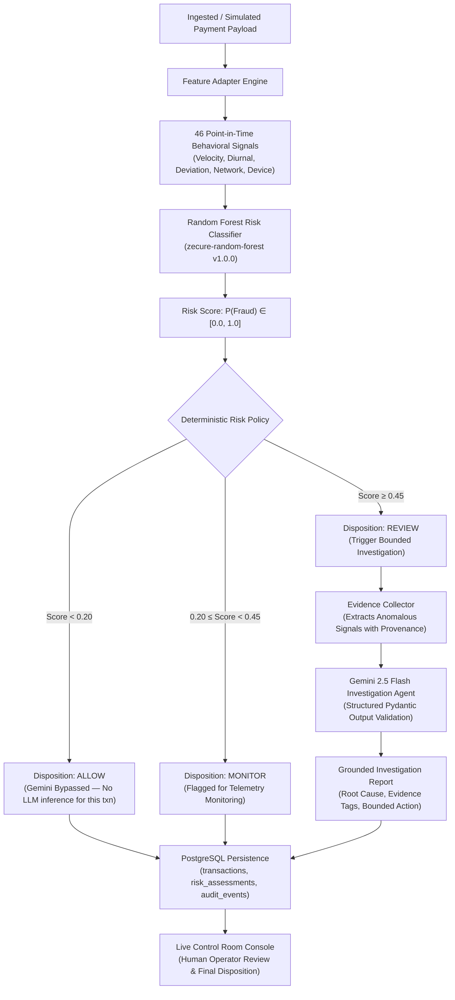

# ZECURE — AI Risk Manager for Payment Fraud

<p align="center">
  <b>Detect suspicious payment behavior and assist merchant risk operators in investigating potentially fraudulent transactions.</b><br/>
  <i>Built for <b>Razorpay Buildathon — Track 02: AI Risk Manager</b></i>
</p>

<p align="center">
  <a href="https://zecureone.netlify.app"></a>
  <a href="https://zecure-api.onrender.com/health"></a>
  <a href="https://github.com/samarth3101/Zecurex-platform"></a>
</p>

<p align="center">
  
  
  
  
  
  
  
</p>

---

## Executive Summary

> **Core Philosophy**: *"ML detects patterns. Deterministic policy classifies risk. Gemini investigates evidence. Human operators make the final call."*

Zecure is an **AI-assisted payment fraud risk management platform** for online merchants. Instead of allowing black-box generative AI to make unconstrained financial settlement decisions, Zecure implements a defensive, multi-tier pipeline:

1. **46 Behavioral Features**: Calculates velocity aggregations, deviation ratios, and network anomalies strictly before transaction timestamp $t$.
2. **Random Forest Classifier**: Computes a fast risk score (<15ms local model inference latency on CPU benchmark; excludes network/API/database latency) evaluated with **96.08% Recall** on 15,000 held-out synthetic test samples.
3. **Deterministic Policy Boundary**: Authoritative code-level thresholds route transactions to `ALLOW`, `MONITOR`, or `REVIEW`.
4. **Bounded Gemini 2.5 Flash Investigation**: Automatically generates grounded root-cause explanations and structured evidence tags for transactions flagged for review, reducing unsupported assertions.
5. **Auditable Decision Workspace**: Persists all features, scores, and AI assertions in PostgreSQL audit tables for human operator review.

---

## Directly dive to world of Zecure - https://zecureone.netlify.app/

## AI Risk Manager Alignment

> **Track Goal**: *"Stop the merchant losing money to fraud, returns and chargebacks. Build a working detector, verifier or auto-responder for one class of loss, with measured precision and recall on a held-out test set. Strictly defense-only."*

Zecure focuses on **one specific class of loss**: **Payment Fraud & Unauthorized Transaction Risk** (across UPI, Card, and Netbanking vectors). It does not address returns or chargeback disputes.

| Track Requirement | Zecure Implementation | Verified Repository Artifacts |
|---|---|---|
| **One Class of Loss** | **Payment Fraud / Unauthorized Transactions** | Detects suspicious transaction-level payment behavior before merchant loss occurs. |
| **Working Detector** | **46-Signal Point-in-Time Random Forest** | Pre-trained `zecure-random-forest` v1.0.0 (`ml/models/zecure_risk_model.joblib`). |
| **Measured Evaluation** | **15,000 Synthetic Held-Out Transactions** | Evaluated on a separate held-out test dataset (`ml/evaluation/test_evaluation.json`). |
| **Measured Recall** | **96.08%** (98 of 102 fraud samples flagged) | 98.40% simulated fraud-value capture (₹27.14L of ₹27.58L in the held-out test set). |
| **Measured Precision** | **29.97%** ($F_1: 0.4569$) | Tuned for high fraud-capture sensitivity at operating threshold $\tau = 0.45$. |
| **False-Positive Cost Analysis** | **₹12,619.48** estimated review friction | Modeled operational review cost across 229 flagged legitimate test transactions. |
| **Verifier / Investigation** | **Evidence-Grounded Gemini 2.5 Flash Agent** | Bounded investigation layer providing structured root-cause explanations for flagged cases. |
| **Decision Authority** | **Deterministic Risk Policy Boundary** | Code-level policy controls risk disposition (`ALLOW`, `MONITOR`, `REVIEW`). |
| **Defense-Only Guarantee** | **Strictly Protective & Auditable** | Purely defensive risk detection and operator review; zero offensive capabilities. |

---

## Model Evaluation on Held-Out Test Set

The Zecure ML Risk Engine was evaluated against a **held-out synthetic test set of 15,000 transactions** (14,898 legitimate, 102 fraudulent) generated with point-in-time behavioral states without lookahead bias.

### Classification & Economic Metrics (`ml/evaluation/test_evaluation.json`)

| Metric | Measured Value | Evaluation Context |
|---|---:|---|
| **Held-Out Test Set Size** | **15,000** | Genuinely separate synthetic test split (`exp_phase5d`). |
| **Operating Decision Threshold ($\tau$)** | **0.45** | Threshold triggering `REVIEW` status. |
| **Recall (Fraud Detection Rate)** | **96.08%** | **98 of 102 fraudulent test transactions were flagged for review.** |
| **Precision** | **29.97%** | Optimized for high sensitivity in extreme class imbalance (0.68% fraud rate). |
| **$F_1$ Score** | **0.4569** | Harmonic mean of precision and recall. |
| **Precision-Recall AUC (PR-AUC)** | **0.9160** | Area under the precision-recall curve across all thresholds. |
| **ROC-AUC** | **0.9984** | Separation between legitimate and fraudulent feature distributions. |
| **False Positive Rate (FPR)** | **1.54%** | 229 out of 14,898 legitimate payments flagged for review. |
| **Brier Score** | **0.00765** | Mean squared difference between predicted risk score and true label. |
| **Total Simulated Fraud Exposure** | **₹27,57,749.08** | Sum of all fraudulent transaction amounts in test set. |
| **Simulated Fraud Value Flagged** | **₹27,13,751.63** | **₹27.14 Lakhs of simulated fraudulent transaction value flagged for review.** |
| **Legitimate Value Flagged for Review** | **₹11,69,480.95** | Total legitimate volume funneled into operator review queue. |
| **Estimated False-Positive Cost** | **₹12,619.48** | Modeled operational review cost ($229\text{ reviews} \times \text{friction factors}$). |
| **Modeled Net Economic Utility** | **+₹27,01,132.15** | Modeled quantity: $(\text{Fraud Flagged} - \text{Estimated Review Cost})$ (not observed cash savings). |

### Confusion Matrix on 15,000 Held-Out Samples

```text
                      Actual Legitimate       Actual Fraudulent
Predicted ALLOW             14,669 (TN)                 4 (FN)
Predicted REVIEW               229 (FP)                98 (TP)
```

> [!IMPORTANT]
> **Offline Evaluation vs. Live Demo Distinction**:
> The metrics above represent **offline evaluation on a synthetic held-out test dataset**. When interacting with the **Live Demo**, you are executing **live inference** on simulated transactions through the deployed backend pipeline.

---

## The Problem: Merchant Losses to Payment Fraud

Online merchants face a difficult trade-off when protecting against payment fraud:

1. **Transaction Amount Alone is Insufficient**: High-value transactions from verified customers are often legitimate, while low-value card-testing scripts exploit velocity across hundreds of micro-transactions.
2. **Behavioral Blindspots**: Velocity bursts (e.g., 5 transactions in 60s), nocturnal execution, IP-to-customer geographic jumps, and device switching are invisible to simple threshold rules.
3. **High False-Positive Friction**: Rigid rule engines decline valid transactions, damaging customer retention and creating unnecessary manual review friction.
4. **The Need for Bounded AI**: For payment-risk workflows, we keep financial decision authority deterministic and auditable rather than delegating it to an unconstrained generative model.

---

## The Solution: 4-Tier Architecture

Zecure structures the transaction risk lifecycle into four distinct operational tiers:

```
Tier 1: 46 Point-in-Time Behavioral Features
        ↓
Tier 2: Random Forest Risk Classifier (zecure-random-forest v1.0.0)
        ↓
Tier 3: Deterministic Policy Boundary (ALLOW / MONITOR / REVIEW)
        ↓
Tier 4: Bounded Gemini 2.5 Flash Investigation (REVIEW cases only)
        ↓
Supporting Infrastructure: PostgreSQL Audit Event Store & Operator Console
```

1. **Tier 1 — Feature Engineering**: Extracts 46 point-in-time signals with strict historical guarantees.
2. **Tier 2 — ML Risk Scoring**: Random Forest calculates a fast risk probability score (<15ms local model inference latency on CPU benchmark; excludes network/API/database latency).
3. **Tier 3 — Deterministic Policy**: Code-level policy routes transactions into operational dispositions (`ALLOW`, `MONITOR`, `REVIEW`). Low-risk payments bypass Gemini entirely.
4. **Tier 4 — Bounded AI Investigation**: Gemini 2.5 Flash evaluates structured anomaly tags extracted by the application for flagged transactions ($Score \ge 0.45$), generating structured root-cause explanations and severity ratings.
5. **Human-in-the-Loop Review**: Human risk operators inspect the complete evidence provenance in the control room to make final operational dispositions.

---

## End-to-End Decision Pipeline



---

## The 46 Behavioral Features

The `FeatureAdapter` (`apps/api/app/services/risk_engine/feature_adapter.py`) extracts 46 point-in-time features strictly from historical transaction context prior to the transaction timestamp ($< t$):

```
┌──────────────────────────────────────┬──────────────────────────────────────┐
│ Feature Category (Count)             │ Exact Signal Names in Pipeline       │
├──────────────────────────────────────┼──────────────────────────────────────┤
│ 1. Transaction Base (7)              │ amount, amount_log, international_flag,│
│                                      │ payment_method, transaction_hour,    │
│                                      │ transaction_day_of_week, is_weekend  │
├──────────────────────────────────────┼──────────────────────────────────────┤
│ 2. Velocity Aggregations (5)         │ customer_txn_count_5m,               │
│                                      │ customer_txn_count_15m,              │
│                                      │ customer_failed_attempts_5m,         │
│                                      │ merchant_txn_count_5m,               │
│                                      │ merchant_txn_count_1h                │
├──────────────────────────────────────┼──────────────────────────────────────┤
│ 3. Customer Volume & Spend (8)       │ customer_transaction_count_1h, 24h, 7d│
│                                      │ customer_avg_amount_24h, 7d,         │
│                                      │ customer_std_amount_7d,              │
│                                      │ customer_max_amount_7d,              │
│                                      │ customer_total_spend_7d              │
├──────────────────────────────────────┼──────────────────────────────────────┤
│ 4. Amount Deviation & Z-Scores (3)   │ amount_vs_customer_avg,              │
│                                      │ amount_zscore_customer,              │
│                                      │ amount_vs_customer_max               │
├──────────────────────────────────────┼──────────────────────────────────────┤
│ 5. Failure & Success Patterns (5)    │ customer_success_rate_24h,           │
│                                      │ customer_failure_count_1h, 24h,      │
│                                      │ customer_failure_rate_7d,            │
│                                      │ customer_consecutive_failures        │
├──────────────────────────────────────┼──────────────────────────────────────┤
│ 6. Payment Instrument Dynamics (3)   │ customer_unique_payment_methods_7d,  │
│                                      │ customer_payment_method_changes_24h, │
│                                      │ is_new_payment_method                │
├──────────────────────────────────────┼──────────────────────────────────────┤
│ 7. Merchant Baseline & Fraud Risk (5)│ merchant_transaction_count_24h,      │
│                                      │ merchant_avg_amount_24h,             │
│                                      │ merchant_failure_rate_24h,           │
│                                      │ merchant_refund_rate_7d,             │
│                                      │ merchant_unique_customer_count_24h   │
├──────────────────────────────────────┼──────────────────────────────────────┤
│ 8. Device & Network Graph Signals (5)│ device_unique_customers_7d,          │
│                                      │ ip_unique_customers_24h,             │
│                                      │ ip_transaction_count_1h,             │
│                                      │ device_transaction_count_1h,         │
│                                      │ customer_device_count_30d            │
├──────────────────────────────────────┼──────────────────────────────────────┤
│ 9. Geographic & Cross-Border (3)     │ customer_unique_regions_30d,         │
│                                      │ is_new_region, international_change  │
├──────────────────────────────────────┼──────────────────────────────────────┤
│ 10. Refund Patterns (2)              │ customer_refund_count_7d,            │
│                                      │ customer_refund_rate_30d             │
└──────────────────────────────────────┴──────────────────────────────────────┘
```

### Top Feature Importances (Random Forest Gini Importance):
1. **`transaction_hour`** (51.78%): Highest-ranked feature by Gini split importance in the evaluation model.
2. **`customer_txn_count_15m`** (9.18%): Identifies rapid velocity bursts and card-testing patterns.
3. **`merchant_txn_count_1h`** (5.69%): Evaluates merchant-level aggregate transaction surges.
4. **`amount_log`** (5.06%) & **`amount`** (3.17%): Scales transaction value distributions.
5. **`ip_transaction_count_1h`** (1.29%): Evaluates multi-account activity originating from a single IP.

*(Note: Feature importance reflects statistical usefulness in decision tree splits within the synthetic training dataset, not causal proof. In this synthetic dataset, nocturnal transaction timing was a primary differentiator across injected fraud scenarios; live production distributions would exhibit broader multi-signal weighting.)*

---

## Random Forest Classifier (`zecure-random-forest`)

- **Artifact**: `ml/models/zecure_risk_model.joblib` ($1.26\text{ MB}$).
- **Measured Local Latency**: <15ms local model inference latency (CPU benchmark; excludes network/API/database latency).
- **Role**: Computes risk probability score $\in [0.0, 1.0]$.
- **Risk Tiers**:
  - `LOW`: Score $< 0.20$
  - `MEDIUM`: $0.20 \le \text{Score} < 0.45$
  - `HIGH`: $0.45 \le \text{Score} < 0.75$
  - `CRITICAL`: Score $\ge 0.75$

---

## Deterministic Risk Policy

The `RiskPolicy` (`apps/api/app/services/risk_engine/risk_policy.py`) enforces strict code-level operational boundaries:

```python
# Authoritative policy boundary implemented in apps/api/app/services/risk_engine/risk_policy.py
if risk_score >= 0.45:
    decision = "REVIEW"    # Trigger bounded Gemini investigation & route to operator review
elif risk_score >= 0.20:
    decision = "MONITOR"   # Allow transaction, tag for telemetry monitoring
else:
    decision = "ALLOW"     # Low risk: Immediate pass-through (Gemini completely bypassed)
```

---

## Bounded Gemini 2.5 Flash Investigation

- **Model**: `gemini-2.5-flash` via the official `google-genai` Python SDK.
- **Trigger**: Activated **only** when `decision == "REVIEW"` ($\text{Risk Score} \ge 0.45$).
- **Structured Schema**: Validated via Pydantic model (`response_schema=InvestigationResult`).
- **Grounded Evidence**: Receives only extracted point-in-time behavioral anomalies from `EvidenceCollector` (does not query raw database tables directly).
- **Output Structure**:
  - `root_cause_analysis`: Concise explanation of primary risk drivers.
  - `confidence_score`: Float between $0.0$ and $1.0$.
  - `risk_signals`: Array of specific signals with category and severity (`LOW`, `MEDIUM`, `HIGH`, `CRITICAL`).
  - `recommended_action`: Bounded recommendation (`ALLOW`, `MONITOR`, `REVIEW`, `ESCALATE`).

> [!IMPORTANT]
> **Advisory-Only AI Boundary**:
> Gemini’s recommendation is advisory. It **does not alter the deterministic risk decision** without human operator intervention in the audit trail.

---

## Evidence Provenance & Auditability

Zecure tracks relationships across input telemetry, model scores, and AI assertions:

```text
Transaction [pay_...] ──> RiskAssessment (Score: 0.62, Features: 46 JSON)
                             └── Investigation (Agent: Gemini 2.5 Flash, Findings: [...])
                                   └── AuditEvent (Actor: RISK_ENGINE, Action: FLAGGED_REVIEW)
```

- **`transactions`**: Raw payment context, customer identifiers, payment methods.
- **`risk_assessments`**: Output probability, risk level, policy decision, full 46-feature JSON snapshot.
- **`investigations`**: Gemini reasoning, signal breakdown, structured recommendations.
- **`audit_events`**: Append-oriented ledger of state changes, timestamps, and operator actions.

---

## Live Demo & How to Test

### Live Deployment URLs:
- **Frontend Dashboard**: [https://zecureone.netlify.app](https://zecureone.netlify.app)
- **Backend API**: [https://zecure-api.onrender.com](https://zecure-api.onrender.com)
- **Health Endpoint**: [https://zecure-api.onrender.com/health](https://zecure-api.onrender.com/health)

> [!NOTE]
> All payment transactions in the live demonstration are **simulated transactions** generated via the integrated transaction simulator to represent gateway-style transaction input.

### Judge Testing Walkthrough:

1. **Open the Console**: Navigate to [https://zecureone.netlify.app/dashboard/login](https://zecureone.netlify.app/dashboard/login).
2. **Register an Operator Account**: Click **Register**, enter your details, and submit.
3. **Verify Email OTP**: Enter the 6-digit OTP sent via Resend (or displayed in the development banner).
4. **Enter the Dashboard**: Access the **Risk Intelligence Overview**.
5. **Run a Simulation**: Click **Simulate Transaction** in the top navigation bar.
6. **Trigger a High-Risk Anomaly**:
   - Select a high amount (e.g. ₹9,45,000), payment method: `UPI`, with high velocity.
   - Click **Inject Transaction**.
7. **Inspect the Risk Decision**:
   - View the **Risk Score** (e.g., $0.62$) and **Policy Decision** (`REVIEW`).
   - Open **Behavioral Signals** to see the 46 extracted point-in-time features.
   - Open **AI Investigation** to inspect Gemini 2.5 Flash's structured reasoning.
   - Open **Audit Trail** to verify the append-oriented PostgreSQL ledger entry.

---

## Concrete Demonstrated Case (Simulation Example)

| Lifecycle Step | Telemetry / Output | Architectural Role |
|---|---|---|
| **1. Ingested Transaction** | `₹9,45,000.00` via `UPI` from anomalous IP | High-value simulated payment with rapid velocity escalation. |
| **2. Feature Adapter** | `transaction_hour: 7`, `customer_txn_count_15m: 2`, `amount_vs_customer_avg: 12.91` | 46 features computed from historical context before $t$. |
| **3. Random Forest** | `risk_score: 0.62`, `risk_level: HIGH` | Local model inference (<15ms) detects velocity spike and baseline deviation. |
| **4. Risk Policy** | `decision: REVIEW` (Triggered because $0.62 \ge 0.45$) | Authoritative code boundary routes transaction to operator review queue. |
| **5. Evidence Collector** | Aggregates velocity spike, payment method anomaly, and amount deviation | Packages structured evidence payload with signal provenance. |
| **6. Gemini Agent** | Hypothesizes account takeover; tags `velocity_burst` as `HIGH` | Generates structured explanation without overriding policy. |
| **7. Audit Event** | Inserted into `audit_events` and `investigations` tables | Append-only state transition logged with timestamp. |

---

## Tech Stack

| Domain | Technology | Implementation Role |
|---|---|---|
| **Frontend** | **Next.js 16 (App Router)** | High-density fintech dashboard. |
| | **React 19 & TypeScript** | Type-safe UI components, charts, and state synchronization. |
| | **SCSS Modules & Framer Motion** | Dark fintech styling, responsive layouts, micro-animations. |
| | **Lucide Icons** | Visual indicators and iconography. |
| **Backend** | **Python 3.12** | Core API execution environment. |
| | **FastAPI** | Asynchronous REST API framework. |
| | **SQLAlchemy 2.0 (Async)** | Async ORM and query builder. |
| | **Asyncpg** | High-performance async PostgreSQL driver. |
| | **Alembic** | Database schema migration management (Head: `6a8f12d45e90`). |
| | **Pydantic v2** | Request validation, settings management, and structured schemas. |
| **AI / ML** | **Scikit-Learn** | Random Forest model training and inference. |
| | **Joblib & Pandas** | Model serialization, pipeline persistence, and feature processing. |
| | **Google GenAI SDK (Gemini 2.5 Flash)** | Bounded structured investigation for flagged transactions. |
| **Database** | **PostgreSQL** | Relational store for transactions, assessments, and audit logs on Render. |
| **Email** | **Resend API / Dev Provider** | Transactional verification emails, OTPs, and password reset links. |
| **Infrastructure** | **Docker** | Containerized backend deployment with multi-stage builds. |
| | **Render** | Managed Docker Web Service and PostgreSQL database hosting. |
| | **Netlify** | Frontend hosting and deployment. |

---

## Security & Defense-Only Guardrails

- **Strictly Defensive**: Detects and explains payment fraud; contains zero offensive capabilities.
- **Password Storage**: Scrypt hashing with 16-byte cryptographically random salt per password.
- **Session Security**: 32-byte cryptographically secure session tokens stored exclusively as SHA-256 hashes in PostgreSQL.
- **Cross-Origin Cookie Protection**: `SameSite=None; Secure; HttpOnly` cookies in production (`SameSite=Lax` for local dev) synchronizing session state between Netlify and Render.
- **Step-Up Verification**: Automatic 6-digit email OTP challenge on new or unrecognized devices.
- **Production Guardrails**:
  - `dev2024` passcode is **strictly rejected** in production (`401 Unauthorized`).
  - Development OTP inspection endpoint is **strictly blocked** in production (`403 Forbidden`).
  - `DevelopmentEmailProvider` raises a fatal startup error in production if active.

---

## Project Structure

```text
Zecurex-platform/
├── apps/
│   ├── api/                              # FastAPI Backend
│   │   ├── alembic/                      # Database Migration Scripts (Head: 6a8f12d45e90)
│   │   ├── app/
│   │   │   ├── agents/investigation/     # Gemini 2.5 Flash Agent & Provider Abstraction
│   │   │   ├── api/routes/               # API Routes (auth, risk, investigations, dashboard)
│   │   │   ├── core/                     # Configuration, Database Engine, Security
│   │   │   ├── models/                   # SQLAlchemy 2.0 Database Models
│   │   │   ├── schemas/                  # Pydantic Schemas & DTOs
│   │   │   └── services/                 # RiskEngine, FeatureAdapter, AuthService, EmailService
│   │   ├── tests/                        # 35 Automated Pytest Test Cases
│   │   ├── Dockerfile                    # Production Docker Container
│   │   └── pyproject.toml                # Python Dependencies & Packaging
│   │
│   └── web/                              # Next.js 16 Frontend
│       ├── src/
│       │   ├── app/                      # App Router Pages (/dashboard, /login, /register, etc.)
│       │   ├── components/               # UI Components (Charts, Modals, Transaction Details)
│       │   ├── lib/api.ts                # Type-Safe API Client with Credentials Support
│       │   └── middleware.ts             # Edge Authentication Guard Middleware
│       ├── package.json                  # Next.js / React Dependencies
│       └── next.config.ts                # Next.js Webpack Build Configuration
│
├── ml/                                   # Machine Learning Subsystem
│   ├── features/                         # FeatureBuilder & TimeWindowAggregator (46 features)
│   ├── models/
│   │   └── zecure_risk_model.joblib      # Pre-Trained Random Forest Classifier (1.26 MB)
│   └── evaluation/
│       ├── test_evaluation.json          # Held-Out Evaluation Metrics (15,000 samples)
│       └── investigation_evaluation.json # Gemini Agent Evaluation Scenarios
│
├── docker-compose.yml                    # Local Monorepo Orchestration
├── netlify.toml                          # Netlify Next.js Edge Deployment Config
├── .env.example                          # Environment Variable Template
└── README.md                             # Technical Documentation
```

---

## Local Development Setup

### Prerequisites
- **Python 3.12+**
- **Node.js 20+** and **npm**
- **PostgreSQL 15+** (or Docker)

### 1. Clone & Setup Environment
```bash
git clone https://github.com/samarth3101/Zecurex-platform.git
cd Zecurex-platform
cp .env.example apps/api/.env
```

### 2. Backend Setup
```bash
cd apps/api
python3 -m venv .venv
source .venv/bin/activate
pip install -e .

# Run Database Migrations
alembic upgrade head

# Start FastAPI Dev Server
uvicorn app.main:app --host 0.0.0.0 --port 8000 --reload
```

### 3. Frontend Setup
```bash
cd ../web
npm install
npm run dev
```

Open [http://localhost:3000](http://localhost:3000) in your browser.

### 4. Run Entire Stack with Docker Compose
```bash
docker compose up --build
```

---

## Testing & Verification

The repository maintains an automated test suite verifying security guardrails, ML inference, and API contracts:

### Run Backend Tests (35/35 Passed):
```bash
cd apps/api
.venv/bin/python -m pytest tests/ -v
```
```text
======================= 35 passed, 420 warnings in 4.06s =======================
```

### Run Frontend Production Build:
```bash
cd apps/web
npm run build
```
```text
✓ Generating static pages using 7 workers (16/16) in 233ms
✓ Compiled successfully with zero errors.
```

---

## Limitations & Technical Disclosures

1. **Simulated Payments**: In compliance with buildathon demonstration guidelines, payment transactions are generated via the simulation engine representing gateway-style payloads rather than processing live banking settlements.
2. **Cold Starts on Free Cloud Tiers**: On free-tier hosting, the backend may experience a cold start after periods of inactivity.
3. **Synthetic Training Data Scope**: The Random Forest model was trained on synthesized point-in-time transaction patterns representing typical Indian payment vectors (UPI, Card, Netbanking). Offline metrics should not be interpreted as guaranteed production performance on real banking traffic.
4. **Modeled False-Positive Cost**: Estimated false-positive cost (₹12,619.48) is modeled from operational review friction; real-world costs may vary by merchant support staffing and volume.
5. **Advisory AI Role**: Gemini 2.5 Flash is strictly an explanatory investigation layer; it does not replace the deterministic risk policy boundary.

---

## Future Roadmap

- **Live Razorpay Webhook Ingestion**: Native webhook receivers for live Razorpay payment gateway event streams.
- **Streaming Telemetry**: Kafka / Redis Streams pipeline for sub-millisecond sliding velocity calculations across millions of cards.
- **Graph-Based Fraud Detection**: Graph Neural Network (GNN) integration to detect mule account syndicates and coordinated card testing rings.
- **Merchant-Specific Dynamic Thresholding**: Automated adjustment of $\tau$ based on individual merchant margin profiles and false-positive tolerance.

---
## License

This project is licensed under the MIT License.
